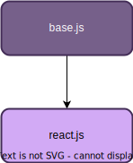

# Config ESLint

Shared configuration to use with [ESLint](https://eslint.org/).

The configuration will consider that [ESLint v9.0.0](https://eslint.org/blog/2024/04/eslint-v9.0.0-released/) or higher and the use of [Flat config](https://eslint.org/blog/2022/08/new-config-system-part-2/).

## Typescript configurations

There are 2 available ESLint configuration files:

- `base.js`: For a basic typescript project.
- `react.js`: For a React project (extends base config).

<p align="center">
  
</p>

## Usage

To use ESlint rules in your project, follow [usage Examples](./docs/USAGE.md)

## Rules

### Variables

> ['no-var'](https://eslint.org/docs/latest/rules/no-var): 'error'

<a name="no-var"></a>

- [no-var](#no-var): 'error'
  [Documentation](https://eslint.org/docs/latest/rules/no-var)

```js
/** ❌ bad */
var x = 'y';
var CONFIG = {};

/** ✅ good */
let x = 'y';
const CONFIG = {};
```

> ['prefer-const'](https://eslint.org/docs/latest/rules/prefer-const#rule-details): 'error'

```js
/** ❌ bad */
// it's initialized and never reassigned.
let a = 3;
console.log(a);

/** ✅ good */
// using const.
const a = 0;

// it's never initialized.
let b;
console.log(b);

// it's reassigned after initialized.
let c;
c = 0;
c = 1;
console.log(c);
```

> ['typescript-eslint/no-unused-vars'](https://typescript-eslint.io/rules/no-unused-vars/): 'error'

```js
/** ❌ bad */
const sayHy = (userName = 'John') => {
  return `Hello user`;
};

/** ✅ good */
const sayHy = (_userName = 'John') => {
  return `Hello user`;
};
```

### Objects

> ['@typescript-eslint/prefer-optional-chain'](https://typescript-eslint.io/rules/prefer-optional-chain/): 'error'

```js
/** ❌ bad */
if (check && check.for && check.for.a && check.for.a.condition) {
}

/** ✅ good */
if (check?.for?.a?.condition) {
}
```

> ['object-shorthand'](https://eslint.org/docs/latest/rules/object-shorthand#rule-details): 'warn'

```js
/** ⚠️ warning */
const foo = {
  x: x,
  y: y,
  z: z,
};

/** ✅ good */
var foo = {
  x,
  y,
  z,
};
```

### Imports

TODO: add links and examples

> import/first: 'error'
> import/newline-after-import: 'error'
> import/no-duplicates: 'error'
> simple-import-sort/exports: 'error'
> simple-import-sort/imports: 'error'

### Naming Convention

TODO: add links and examples

### Switch Case

> ['default-case'](https://eslint.org/docs/latest/rules/default-case#rule-details): 'error'

Default case is required.

```js
/** ❌ bad */
switch (a) {
  case 1:
    /* code */
    break;
}

/** ✅ good */
switch (a) {
  case 1:
    /* code */
    break;

  default:
    /* code */
    break;
}
```

> ['no-fallthrough'](https://eslint.org/docs/latest/rules/no-fallthrough#rule-details): ['error', { commentPattern: 'fallthrough' }],

Each case must have a break statement if it has fallthrough.

```js
/** ❌ bad */
switch (foo) {
  case 1:
    doSomething();

  case 2:
    doSomething();
}

/** ✅ good */
switch (foo) {
  case 1:
    doSomething();
    break;

  case 2:
    doSomething();
}

/** ✅ good */
switch (foo) {
  case 1:
  case 2:
    doSomething();
}
```

### Development messages

> ['no-console'](https://eslint.org/docs/latest/rules/no-console): ['warn', { allow: ['warn', 'error'] }],

```js
/** ⚠️ warning */
console.log('Log a debug level message.');

const func_2 = (a, b = 0, c) => {};

/** ✅ good */
console.warn('Log a debug level message.');
console.error('Log a debug level message.');
```

> ['no-warning-comments'](https://eslint.org/docs/latest/rules/no-warning-comments): ['warn', { terms: ['todo', 'fixme', 'to do'], location: 'start' }],

```js
/** ⚠️ warning */
// TODO: your TODO message.
// TO DO: your TO DO message.
// FIXME: your FIXME message.
```

### Function Arguments

> ['default-param-last'](https://eslint.org/docs/latest/rules/default-param-last#rule-details): 'warn',

```ts
/** ⚠️ warning */
const func_1 = (a = 0, b) => {};

const func_2 = (a, b = 0, c) => {};

/** ✅ good */
const func_3 = (a, b = 0) => {};

const func_4 = (a: string, b: number, c?: boolean) => {};
```

> ['max-params'](https://eslint.org/docs/latest/rules/max-params): ['warn', { max: 3 }],

```js
/** ❌ bad */
const myFunction = (v_one, v_two, v_three, v_four, v_five, v_six) => {
  /* code */
  /* max allowed parameters is 5 */
};

/** ⚠️ warning */
const myFunction = (var_one, var_two, var_three, var_four, var_five) => {
  /* code */
  /* max suggested parameters is 3 */
};

/** ✅ good */
const myFunction = (var_one, var_two, var_three) => {
  /* code */
};

/** ✅ good */
// If more than 3 parameters, use object shorthand for last parameters.
const myFunction = (var_one, var_two, { var_three, var_four }) => {
  /* code */
};
```

### Array

> ['@typescript-eslint/prefer-for-of'](https://typescript-eslint.io/rules/prefer-for-of): 'warn',

```js
/** ⚠️ warning */
for (let i = 0; i < array.length; i++) {
  console.log(array[i]);
}

/** ✅ good */
for (const x of array) {
  console.log(x);
}
```

> ['@typescript-eslint/prefer-find'](https://typescript-eslint.io/rules/prefer-find): 'error',

```js
/** ❌ bad */
[1, 2, 3].filter(x => x > 1)[0];
[1, 2, 3].filter(x => x > 1).at(0);

/** ✅ good */
[1, 2, 3].find(x => x > 1);
```

### Conditionals

> ['no-nested-ternary'](https://eslint.org/docs/latest/rules/no-nested-ternary#rule-details): 'warn',

```js
/** ⚠️ warning */
const thing = foo ? bar : baz === qux ? quxx : foobar;

/** ✅ good */
let thing;

if (foo) {
  thing = bar;
} else if (baz === qux) {
  thing = quxx;
} else {
  thing = foobar;
}
```

> ['no-unneeded-ternary'](https://eslint.org/docs/latest/rules/no-unneeded-ternary#rule-details): 'warn',

```js
/** ⚠️ warning */
const a = x === 2 ? true : false;

/** ✅ good */
const a = x === 2;
```

> ['no-else-return'](https://eslint.org/docs/latest/rules/no-else-return): 'warn',

```js
/** ⚠️ warning */
export const foo1 = (x, y, z) => {
  if (x) {
    return y;
  } else {
    return z;
  }
};

/** ✅ good */
export const foo1 = (x, y, z) => {
  if (x) {
    return y;
  }

  return z;
};
```

> ['@typescript-eslint/prefer-nullish-coalescing'](https://typescript-eslint.io/rules/prefer-nullish-coalescing/): 'warn',

```js
/** ⚠️ warning */
const foo = bar || defValue;

/** ✅ good */
const foo = bar ?? defValue;
```

### Additiona Rules

TODO: add links and examples

> ['@typescript-eslint/member-ordering'](https://typescript-eslint.io/rules/member-ordering): 'error',

> '@typescript-eslint/no-unused-expressions': ['error'],

> '@typescript-eslint/no-non-null-assertion': 'off',

### React

> ['react/jsx-no-useless-fragment'](https://github.com/jsx-eslint/eslint-plugin-react/blob/master/docs/rules/jsx-no-useless-fragment.md): 'error'

```jsx
/** ❌ bad */
<><Foo /></>
<p><>foo</></p>

/** ✅ good */
<Foo />
<p>foo</p>
```

> ['react/jsx-boolean-value'](https://github.com/jsx-eslint/eslint-plugin-react/blob/master/docs/rules/jsx-boolean-value.md): ['error', 'never']

```jsx
/** ❌ bad */
<Hello personal={true} />;

/** ✅ good */
<Hello personal />;
<Hello personal={false} />;
```

> ['react/jsx-curly-brace-presence'](https://github.com/jsx-eslint/eslint-plugin-react/blob/master/docs/rules/jsx-curly-brace-presence.md): 'error'

```jsx
/** ❌ bad */
<App prop={'Hello world'}>{'Hello world'}</App>;

/** ✅ good */
<App prop='Hello world'>'Hello world'</App>;
```

> ['react/self-closing-comp'](https://github.com/jsx-eslint/eslint-plugin-react/blob/master/docs/rules/self-closing-comp.md): 'error'

```jsx
/** ❌ bad */
var HelloJohn = <Hello name='John'></Hello>;

/** ✅ good */
var HelloJohn = <Hello name='John' />;
```

## Hooks

> ['react/hook-use-state'](https://github.com/jsx-eslint/eslint-plugin-react/blob/master/docs/rules/hook-use-state.md): 'error'

When using `useState` naming convention is `[xxx, setXxx]`

```jsx
/** ❌ bad */
const [color, updateColor] = React.useState();
const [date, changeDate] = useState();

/** ✅ good */
const [color, setColor] = React.useState();
const [date, setDate] = useState();
```

### TS

> ['@typescript-eslint/array-type'](https://typescript-eslint.io/rules/array-type): 'error',

```ts
/** ❌ bad */
const x: Array<string> = ['a', 'b'];

/** ✅ good */
const x: string[] = ['a', 'b'];
```

# TODO:

- Update files to use TS extension
